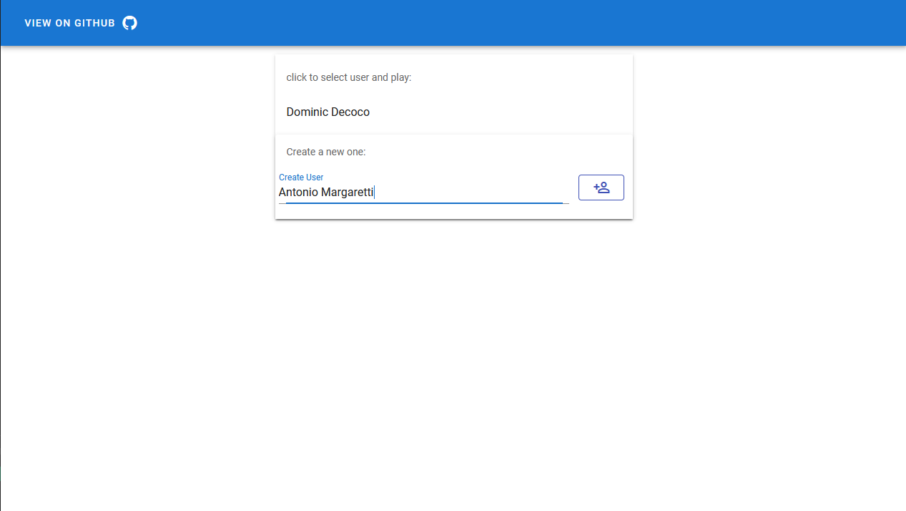
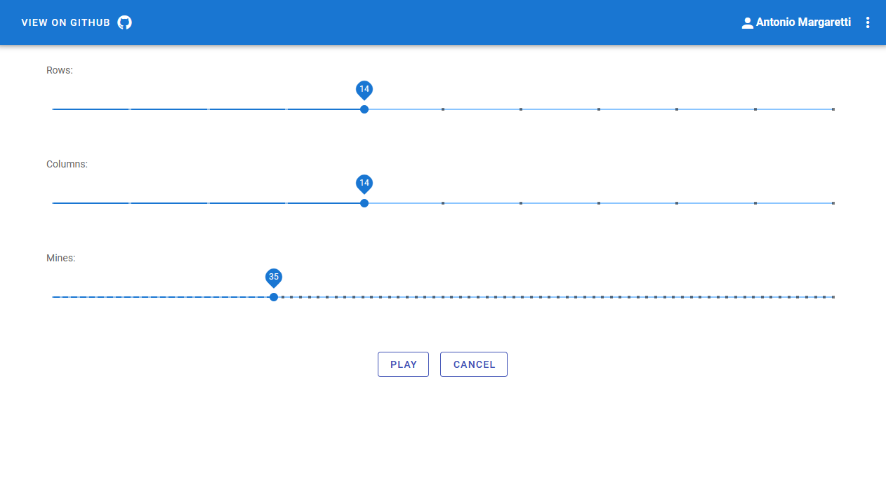
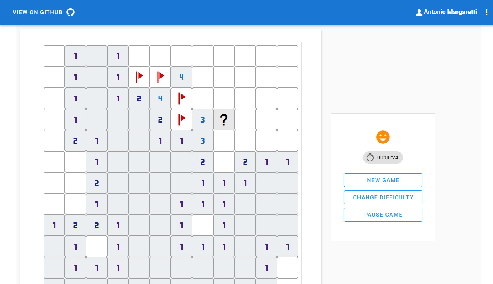

# Minesweeper Api 

java implementation of minesweeper api


## Game play considerations
- The first cell revealed cannot be mined
- There is no time limit on game play
- User needs to enter his name first to play

## Technology stack
- java 11
- spring boot
- spring data mongodb
- mongodb

## Build
### Requirements
- Java 11
- Maven
- Mongodb

```Shell
$ mvn spring-boot:run -Dspring.profiles.active=dev
```

## Documentation
You can find the swagger documentation [here](https://minesweeper-api-pg.herokuapp.com/swagger-ui.html)

## Client

you might want to see the client code for this api, so you can find it here [here](https://github.com/pablogarzon/minesweeper-client)

## Play
You can play a little bit [here](https://minesweeper-client-pg.herokuapp.com)

### Screenshots



